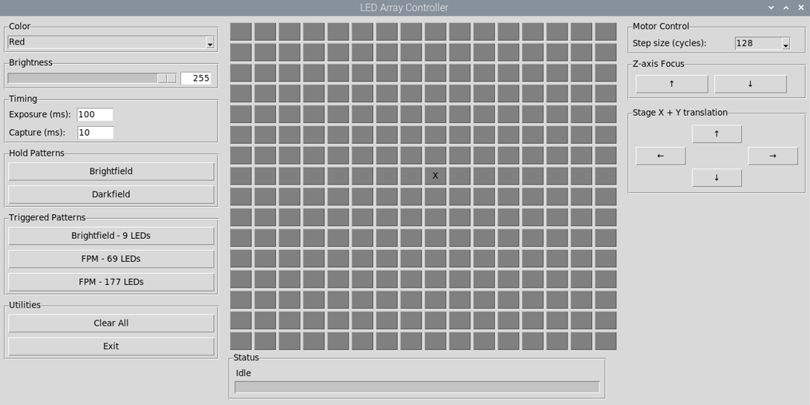

# Software

### FPM GUI for controlling the illumination and translation
- 16x16 WS2812B LEDs
  - Colour
  - Brightness
  - 16x16 LED grid layout
- Timing
  - Exposure time (ms) - LED on
  - Capture time (ms) - LED off
- Patterns (User can make custom LED patterned in the code)
  - Hold - Brightfield (BF) and Darkfield (DF)
  - Triggered - Central 9 LEDs (3 LED diameter circle), 69  LEDs (9 LED diameter circle), 177 LEDs (15 LED diameter circle)
- Motor Control
  - Z-axis focus
  - Stage X and Y translation

  

### Acquiring live FFT imaging from on screen display.
OpenFPM is designed with illuminator translation, allowing the user to manually align the LED array into the optical axis for better reconstruction outputs. Alignment of the LED array is supported using a high contrast sample, and live observation of the brightfield coherent passbands in Fourier Space. This is supported using live on-screen FFT imaging of the sample using the FIJI macro linked below, with credit to the author, Nicolás De Francesco. Below we show an example of the central LED off-axis (Uncorrected) and on-axis (Corrected). Visualisation of the coherent passbands in Fourier space, makes alignment of the LED array into the optical system significantly easier to control.

https://forum.image.sc/t/is-live-fft-of-an-roi-on-screen-possible/31026/4 (November 2019) [Accessed: March 2026]

  

