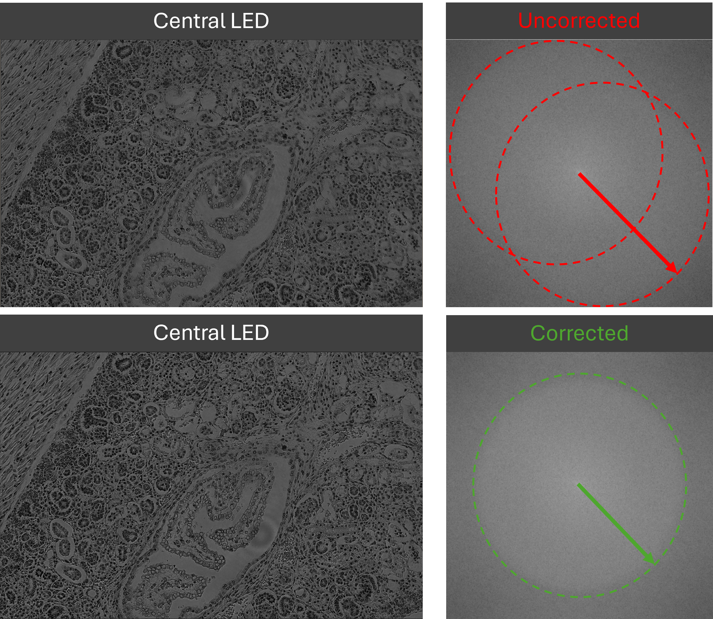

# Software

This folder contains the software used to operate the OpenFPM microscope system, including microscope control, illumination sequencing, motorised positioning, and optical alignmnet support.

### OpenFPM Control GUI

The OpenFPM control software provides a graphical user interface (GUI) for controlling the programmable LED illumination and microscope translation hardware.

### Features

#### LED Illumination Control

- Support for a 16x16 WS2812B LED array
- Adjustable:
  - LED colour
  - LED brightness
- Visual 16x16 LED grid interface

#### Timing

- User-defined timing parameters for image acquisition:
  - Exposure time (ms) - LED on duration
  - Capture time (ms) - LED off duration

#### Illumination Patterns

Predefined and custom illumination patterns are supported.

- Hold modes
  - Brightfield (BF)
  - Darkfield (DF)
- Triggered acquisiion modes
  - Central 9 LEDs (3 LED diameter circle)
  - 69  LEDs (9 LED diameter circle)
  - 177 LEDs (15 LED diameter circle)

User may also define custom LED illumination patterns directly in the code.

#### Motor Control

Integrated manual control of microscope motion:
- Z-axis focus
- X-axis stage translation
- Y-axis stage translation

  

### Live FFT Alignment Support

OpenFPM incorporates a translational LED illuminator, allowing the user to manually align the LED array with the microscope optical axis for improved reconstruction quality.

To support this process, the system uses a high-contrast sample and live Fourier-space observation of the coherent brightfield passbands. This enables the user to visually assess whether the central LED is correctly aligned to the optical axis.

This alignment workflow is supported using a live on-screen FFT display in FIJI, adapted from the macro shared by Nicolás De Francesco [1].

#### Purpose

Live FFT visualisation helps the user:
- Identify off-axis illumination
- Observe coherent passband displacement
- Manually correct LED array alignmnet
- Improve reconstruction consistency and quality

Below is an example showing the central LED:
- Off-axis (uncorrected) position
- On-axis (corrected) psoition

  

### FIJI Macro Reference
Nicolás De Francesco,
“Is live FFT of an ROI on screen possible?”
Image.sc Forum, November 2019.
https://forum.image.sc/t/is-live-fft-of-an-roi-on-screen-possible/31026/4
Accessed: March 2026.

### Notes
- The software was developed for use with the OpenFPM hardware platform and may require modification for alternative hardware configurations
- Custom illumination sequences and acquisition routines can be adapted within the source code depending on the desired imaging protocol.